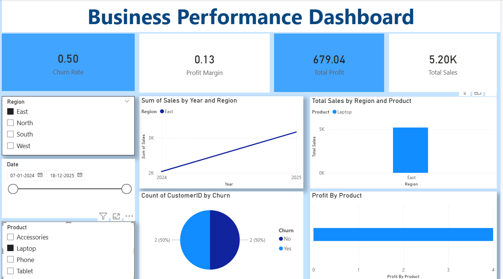

# Business-Performance-Dashboard
“Interactive Business Performance Dashboard using Power BI”
Overview
This project presents an interactive business dashboard built using Power BI to analyze sales, profit, and overall performance.

Key Features
Visualized KPIs like revenue, profit, and growth trends
Interactive filters for region, category, and time
Identified top-performing products and regions

Tools Used
Power BI
Excel / CSV
Data Cleaning & Visualization

Insights
Detected high-profit regions and loss areas
Improved decision-making using data visualization
Dashboard Preview

